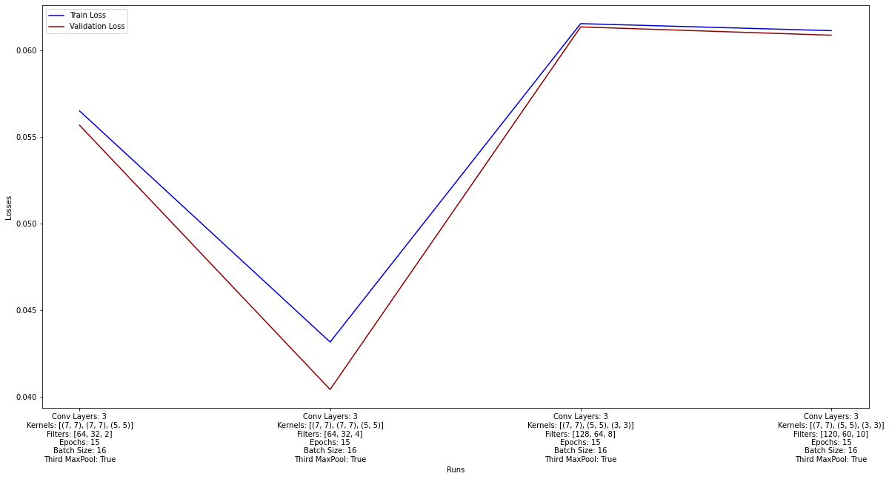

# Analysis
In the current file the results of all algorithms regarding the 4 parts of this project will be analyzed with multiple experiments at a time.

## Part 1
The first parameter that can be tailored is the architecture of the encoder. The [autoencoder](Autoencoder/src/autoencoder/autoencoder.py) file and its [notebook](Autoencoder/notebook/Autoencoder.ipynb) counterpart support many different configuration options like number of convolutional layers, kernel sizes etc. In order to achieve a small dimension for the latent vector, the filter sizes have to be small and the usage of a third max-pooling layer is necessary. The following graph shows the MSE loss among 4 different experiments with latent vector dimensions of 2, 4, 8 and 10 respectively.

The 2nd experiment (with latent dimension of 4) seems the most promising one so this is the one we will be using to generate the new space for **Part 2**.

## Part 2
Having used the 2nd experiment mentioned above (latent dimension = 4) we executed the [search](NN_Clustering/search.cpp) program. For the LSH parameters we used k = 4 and L = 4 as they are a good all-around combination (more on that explained in this [respository](https://github.com/DemetrisKonst/ANN-Clustering) we have created for LSH). The results were the following:
  
- Time-related results
    - Reduced Total Time: 6.27314
    - LSH Total Time: 7.81783
    - True Total Time: 47.5043
- Accuracy-related results
    - Approximation Factor Reduced: 1.89546
    - Approximation Factor LSH: 1.06049
  
First of all, it is clear that both the LSH run and the Reduced space run were much faster than the Original space run. Among the two, the reduced approach seems to be faster but not by a huge amount. Accuracy-wise, LSH is performing as expected, nearing 100% accuracy. On the other hand, the brute force approach on the reduced space is disappointing to say the least, provided that we used the "best" encoder we had.
  
**Note**: We could have obviously used an encoder of a huge latent dimension (e.g. 512) to reach way better results on the reduced space, however that would miss the point of these experiments.

## Part 3
The experiments for this part are pretty straight-forward. The [manhattan](NN_Clustering/manhattan.cpp) evaluation does not accept any parameters, so there is only need to run one single experiment. At this run, the result was the following:
- Average Correct Search Results MANHATTAN: 0.93826
  
Regarding the EMD metric, there is one parameter that can be tweaked: the size of the clusters of the photo. As our images are 28x28, the size has to be either 4x4 or 7x7. However, only a size of 7x7 is actually viable for evaluation, as the 4x4 cluster size does not reduce the amount of weights sufficiently enough, so the program is **very** slow. So, for a cluster size of 7x7 we had the following results:
  

| Dataset Size | Queryset size | Accuracy | Time |
| ------------ | ------------- | -------- | ---- |
| 10000        |  10           |  0.68    | 13m  |
| 60000        |  10           |  0.80    | 77m  |
| 10000        |  60           |  0.73    | 76m  |

  
The evaluation of the EMD metric -as expected- is very costly timewise, if we were to run the whole queryset (10k images) on the whole dataset (60k images), the time to do all that would be approximately 1 month and 24 days, so we obviously ran tests on subsets of those. Whether the actual accuracy of the EMD metric is around 0.8 (based on the 2nd experiment), we can't be sure unless we use some hypercomputers. However, it seems improbable that it will surpass the 0.93 mark of the Manhattan metric.

## Part 4
